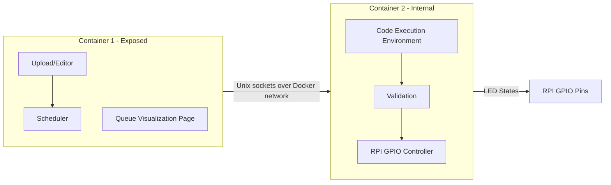

>[!NOTE]
>**Why the fuck are we overcomplicating this?**
> Quite a simple answer -- we study CS. Users study CS. Someone *will* try to (or unintentionally) break our shit. Let's try to not allow that by:
> - Containerizing (to not have direct API access)
> - Sandboxing Languages
> - Rate-limiting and timeouting

# Infrastructure Diagram
The idea for the infra is the following:

```mermaid
architecture-beta
    service python(logos:python)[Python]
    
    service entry(mdi:internet)[Website]
    service runner(mdi:docker)[Containers]    
    python:R --> L:entry
    entry:B -- T:runner
```


Where the containers have the following structure:


>[!NOTE]
> Let A be the container which houses the upload/editor + scheduler + queue visualization page, and B be the container which houses the code execution environment + RPI GPIO controller.

# Container B
Container B will be exposed to Container A over Docker's internal network using Unix socket through the following protocol:

## LED State
Is a tuple of 4 integers.
```
(R, G, B, L)
```
Where R,G,B are 0-255 integers representing the color of the LED, and L is a 0-100 integer representing the brightness level.

## Array of LED States
Is an array of 4-tuples of integers.
```
[(R1, G1, B1, L1), (R2, G2, B2, L2), ...]
```

This array will be of length N, where N is the pre-defined number of LEDs on the christmas tree, as set by the `TREE_LEDS` environment variable.

This is what will be sent from Container A to Container B to set the states of all LEDs.

>[!WARNING]
> For our predicted number of LEDs (500), the math is the following:
> each tuple is max 17 characters long (including commas and parentheses) -> `(255,255,255,100)`
> 500 tuples -> 500 * 17 = 8500 characters
> plus commas between tuples -> 499 commas
> plus square brackets -> 2 characters
> Total: 8999 characters => ~9KB of data per update.
> That's *disgusting* for a color transfer protocol, but atp it's a tradition to fuck this part up
> Be my guest if you want to implement a better protocol.

> [!IMPORTANT]
> An array with less elements than the pre-defined number of leds is **not allowed** and will be rejected by the validation module.

# Container A
As mentioned earlier, Container A will be exposed to the internet and will allow users to upload code to be executed on the christmas tree.

## Python
A subset of Python will be allowed.
- Standard library: `math`, `random`, `time`
- No access to `os`, `sys`, `subprocess`, `ctypes`, etc.
- No access to external modules

example code:
```python
led_count = getLEDCount()
states = [[0, 0, 255, 100] for _ in range(led_count)]  # Set all LEDs to blue
# or states = [BLUE] * led_count
setLEDs(states)
```

> [!NOTE]
> Read the [runner docs](/upload/README.md) for more info on the allowed code and abstractions.

## Web Service
Will provide:

### /upload
- File upload endpoint
- Accepts code files in python
- Check for syntax errors before scheduling
- Maybe check for infinite loops? (ASTs are pretty fucking hard)
- Returns success/failure response

### /queue
- Shows the queue of scheduled
- Shows estimated time until execution
- Shows status (pending, running, completed, failed)

### /editor
- Web-based code editor with syntax highlighting
- Not sure if we need to go that far, but could be nice
- "Run" button to upload and schedule code directly from the editor

## Scheduler
FCFS obviously, with a max execution time of 45 seconds per code snippet.
Each submission gets:

| **Thing**   | **Description**                            |
| ----------- | ------------------------------------------ |
| `uuid`      | UUID of submission                         |
| `timestamp` | Time of submission                         |

No need for manual handling or DBs (no Mongo @masecla22, sorry), just store file as `<uuid>.py` and save metadata separately. 

>[!NOTE]
> any self-respecting webserver does threading for us, so we don't need to worry about race conditions in uploading

As for the execution queue, a simple in-memory queue should suffice. On server start, we can scan the upload directory for any pending submissions and add them to the queue. Needless to say, each process is subprocessed and watched by parent.

